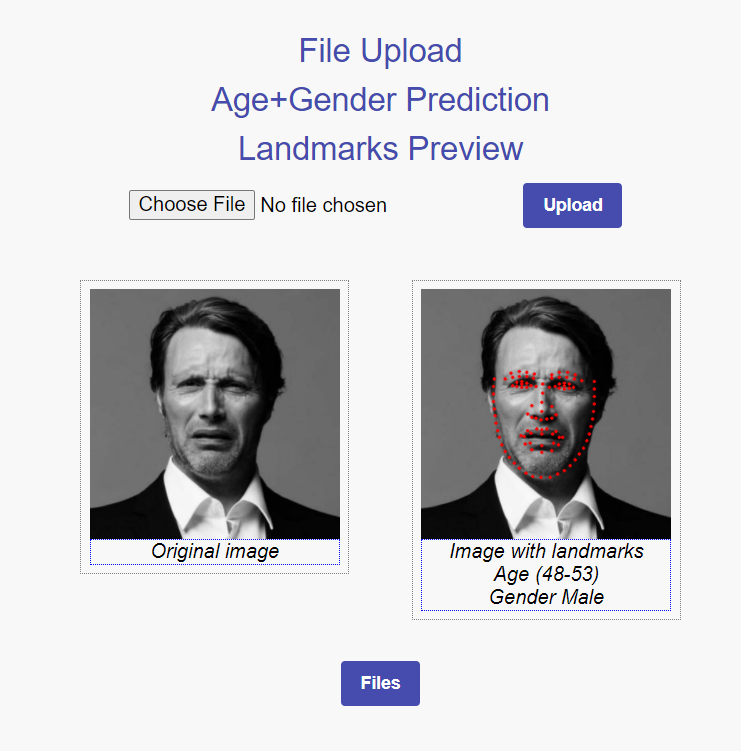

# Face Landmarks detection & age prediction & gender prediction Spring application in Kotlin



Repo contains source code of application for prediction gender and age of person in the image and for face landmarks detection. Rhe upload images are stored and can be downloaded with detected landmarks.

## Installation

To use KotlinDL in your project, add the following dependency to your `build.gradle` file:
```
   repositories {
      mavenCentral()
   }
   
   dependencies {
       implementation ("org.jetbrains.kotlinx:kotlin-deeplearning-api:[KOTLINDL-VERSION]")
       implementation ("org.jetbrains.kotlinx:kotlin-deeplearning-onnx:[KOTLINDL-VERSION]")
       implementation ("org.jetbrains.kotlinx:kotlin-deeplearning-visualization:[KOTLINDL-VERSION]")
   }
```
For the reference use [`build.gradle.kts`](./build.gradle.kts) from this repository

## Neural Network
[`ImagePreprocessing.kt`](src/main/kotlin/org/decembrist/faceprocessing/neuralnetwork/imageprocessing/ImagePreprocessing.kt) script contains methods for preprocessing of images before putting them in Neural Network models and before visualization.

[`DownloadFileController.kt`](src/main/kotlin/inference.kt) script is used for listing uploaded images and images with face landmark and for downloading them from server.

[`FANModel.kt`](src/main/kotlin/org/decembrist/faceprocessing/neuralnetwork/FANModel.kt) script contains Face Alignment Network model loading and it's inference for raw image file.

[`AgeGoogleNetModel.kt`](src/main/kotlin/org/decembrist/faceprocessing/neuralnetwork/AgeGoogleNetModel.kt) script contains GoogleNet model loading and it's inference for Age prediction for raw image file.

[`GenderModel.kt`](src/main/kotlin/org/decembrist/faceprocessing/neuralnetwork/GenderGoogleNetModel.kt) script contains GoogleNet model loading and it's inference for Gender prediction for raw image file.

## Backend

[`UploadFileController.kt`](https://github.com/korney3/kotlindl-face-processing/blob/master/src/main/kotlin/org/decembrist/faceprocessing/controller/UploadFileController.kt) script is used for controlling the image uploading, applying neural network models to it and demonstrating predictions.

[`DownloadFileController.kt`](src/main/kotlin/org/decembrist/faceprocessing/controller/DownloadFileController.kt) script is used for listing uploaded images and images with face landmarks and for downloading them from server.

## Frontend

[`uploadform.ftlh`](src/main/resources/templates/uploadform.ftlh) file contains html for page with file uploading.

[`listfiles.ftlh`](src/main/resources/templates/listfiles.ftlh) file contains html for page with file listing and downloading.

In Backend and Frontend parts of code from [the source](https://ozenero.com/kotlin-springboot-upload-download-file-multipartfile-thymeleaf-bootstrap-4) were used.
